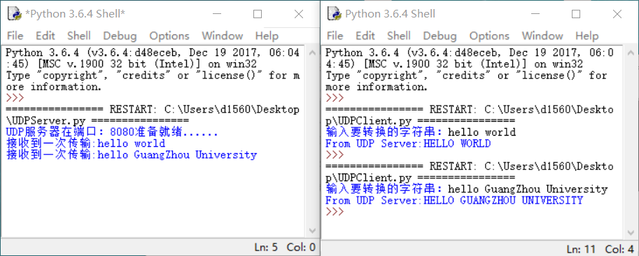

# 实验二 套接字编程实验

### 一、实验目的
1.	理解套接字的概念，区分TCP套接字和UDP套接字；
2.	掌握Python语言下的套接字编程技术。

-----

### 二、实验内容
1.	利用TCP和UDP套接字编程技术，使用Python语言编程完成从客户端输入一行字符，发送到服务器后，由服务器转化成大写字母，回送到客户端并显示。
2.	在一台主机上安装编译TCPClient和UDPClient Python程序，在另一台主机上安装编译TCPServer和UDPServer程序。
如果在运行TCPServer之前运行TCPClient，将发生什么现象？为什么？
如果在运行UDPServer之前运行UDPClient，将发生什么现象？为什么？
如果对客户端和服务端使用了不同的端口，将会发生什么现象？
3.  假定在UDPClient.py中在创建套接字后增加了下面一行：
`clientSocket.bind(('', 5432))`
有必要修改UDPServer.py吗？UDPClient和UDPServer中的套接字端口号是多少？在变化之前它们是多少？

-----

### 三、实验步骤
#### 1. TCP和UDP套接字编程

(1) TCPServer.py代码
```
import socket
s = socket.socket()
s.bind(("127.0.0.1", 8080))
s.listen(5)
print("TCP服务器在端口：8080准备就绪......")
while True:
    c, _ = s.accept()
    recv_data = c.recv(1024)
    print("接收到一次传输：" + bytes.decode(recv_data))
    send_data = recv_data.upper()
    c.send(send_data)
    c.close()
```
 
(2) TCPClient.py代码
 ```
 import socket
c = socket.socket()
c.connect(("127.0.0.1", 8080))
send_data = input("输入要转换的字符串：")
c.send(str.encode(send_data))
recv_data = c.recv(1024)
print("From TCP Server:" + bytes.decode(recv_data))
 ```
 

<center><font size=2>图1  TCPServer和TCPClient运行结果</font></center>

(3) UDPServer.py代码
 ```
 import socket
s = socket.socket(socket.AF_INET, socket.SOCK_DGRAM)
s.bind(('127.0.0.1', 8080))
print("UDP服务器在端口：8080准备就绪......")
while True:
    data, address = s.recvfrom(2048)
    print("接收到一次传输:" + bytes.decode(data))
    s.sendto(data.upper(), address)
 ```

(4) UDPServer.py代码
```
import socket
c = socket.socket(socket.AF_INET, socket.SOCK_DGRAM)
send_data = input("输入要转换的字符串：")
c.sendto(str.encode(send_data), ("127.0.0.1", 8080))
recv_data = c.recv(2048)
print("From UDP Server:" + bytes.decode(recv_data))
```


<center><font size=2>图2 UDPServer和UDPClient运行结果</font></center>

#### 2. Server和Client程序
(1) 在运行TCPServer之前运行TCPClient，将会发生的现象
>如果先运行TCPClient程序，那么客户端将和一个不存在的服务器进程建立TCP连接，并且这个TCP连接将不会被建立。

(2) 在运行UDPServer之前运行UDPClient，将会发生的现象
>UDPClient程序不会和服务器建立一个TCP连接。因此，先运行UDPClient程序，然后再运行UDPServer程序，最后再输入信息，则程序正常运行。

(3) 对客户端和服务端使用了不同的端口，将会发生的现象
>如果使用不同的端口号，那么客户端将尝试去和错误或者不存在的进程建立一个TCP连接。程序将会发生错误。

#### 3. 在UDPClient.py中增加一行`clientSocket.bind(('', 5432))`代码后的问题
(1) UDPClient.py增加代码后,不需要修改UDPServer.py。
>原来的UDPClient程序在创建socket时不指定端口号。在这种情况下，底层操作系统自行选择端口号。而增加代码后，当执行UDPClient程序时，将用端口号5432创建UDP socket。而运行UDPServer程序需要客户端的端口号，才能将数据包发送回正确的客户端socket。观察UDPServer.py的代码，会发现客户端的端口号不是“硬连接”到服务器中的；相反，UDPServer程序是通过解析从客户端接收的数据报来确定客户端的端口号。因此，UDPServer程序可以往任意客户端的端口号发送数据，包括端口号5432。

(2) 在变化之前，UDPClient中的socket端口号是由操作系统决定的，而UDPServer中的socket端口号是8080

(3) 在变化之后，UDPClient中的socket端口号是5432，而UDPServer中的socket端口号仍旧是8080
